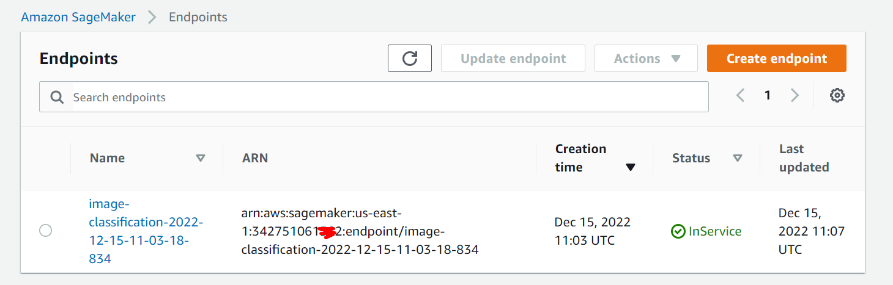
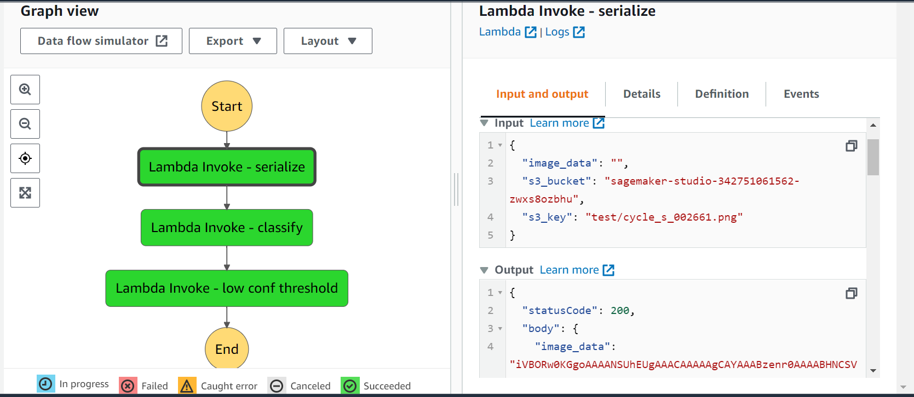
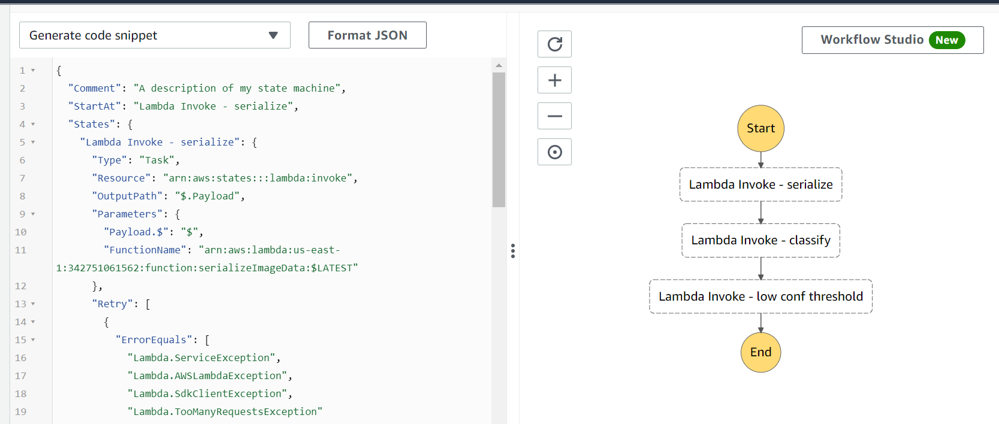
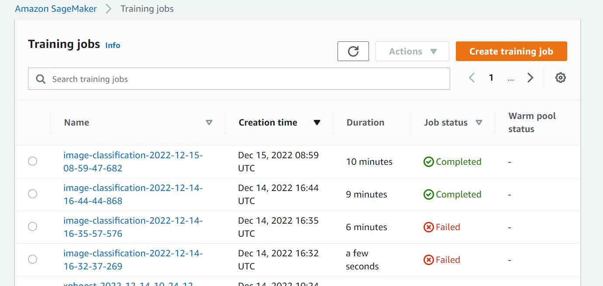
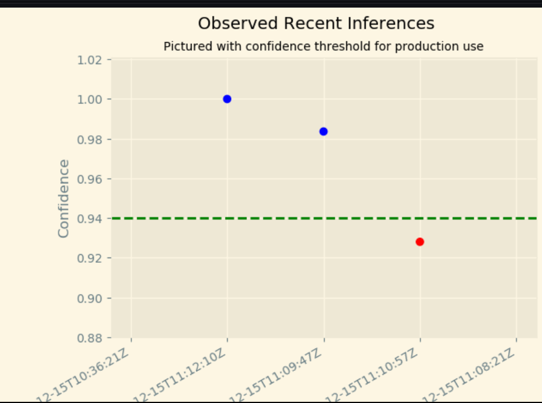
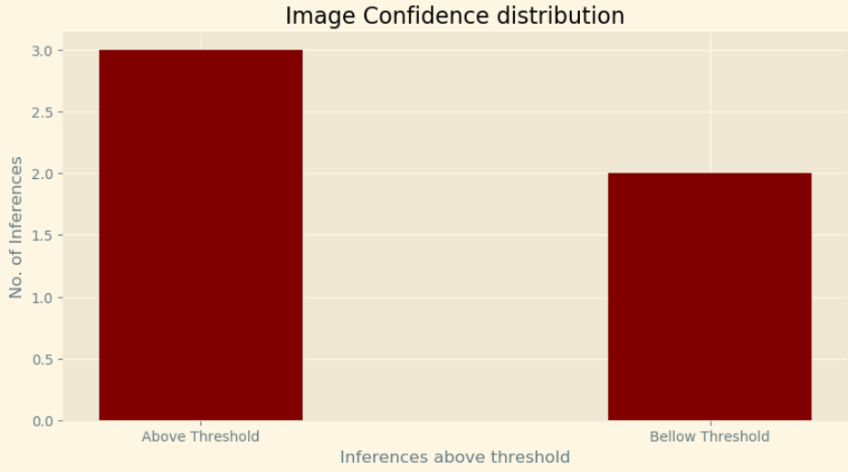
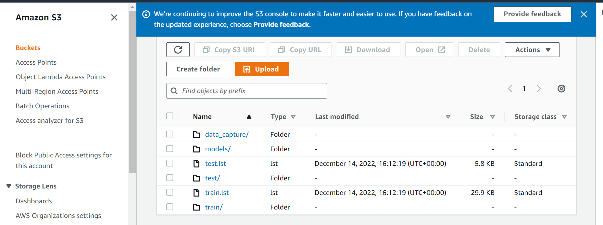

## Project Scope:

This projects takes the role of a Machine Learning Engineer for a scone-delivery-focused logistics company, Scones Unlimited, and you’re working to ship an Image Classification model. 

In this project, the goal is to build an image classification model that can automatically detect which kind of vehicle delivery drivers have, in order to route them to the correct loading bay and orders. Assigning delivery professionals who have a bicycle to nearby orders and giving motorcyclists orders that are farther can help Scones Unlimited optimize their operations.

## Project Steps
Project Steps Overview
- Step 1: Data staging
- Step 2: Model training and deployment
- Step 3: Lambdas and step function - workflow
- Step 4: Testing and evaluation
- Step 5: Optional challenge
- Step 6: Cleanup cloud resources

Pratical steps:
- Perform ETL of the Data 
- Use AWS Image Classifier Image
- Train the Model with a Training Job
- CI / CD of the model Endpoints
- Monitor outputs of the model
- Write the Worflow in lambdsa / AWS StepFunctions

## Project Goal
As an MLE, the goal is to ship a scalable and safe model. Once your model becomes available to other teams on-demand, it’s important that your model can scale to meet demand, and that safeguards are in place to monitor and control for drift or degraded performance.

In this project, I use AWS Sagemaker to build an image classification model that can tell bicycles apart from motorcycles. 

The model is deployed, using AWS Lambda functions to build supporting services, and AWS Step Functions to compose your model and services into an event-driven application. 

## AWS Services / End result

### Model Deployment Endpoint

### Final Lambda Workflow Stepfunction

The files for each of the lambdas is placed on the main folder of this repo.

### State Machine Json 

The json file is also included

### Training Jobs 

### Monitoring 
A monitoring job was placed with a data collection config on the inferences of the endpoint.

This way we can analyse the traffic and take assumptions of it

### S3 Bucket state 

